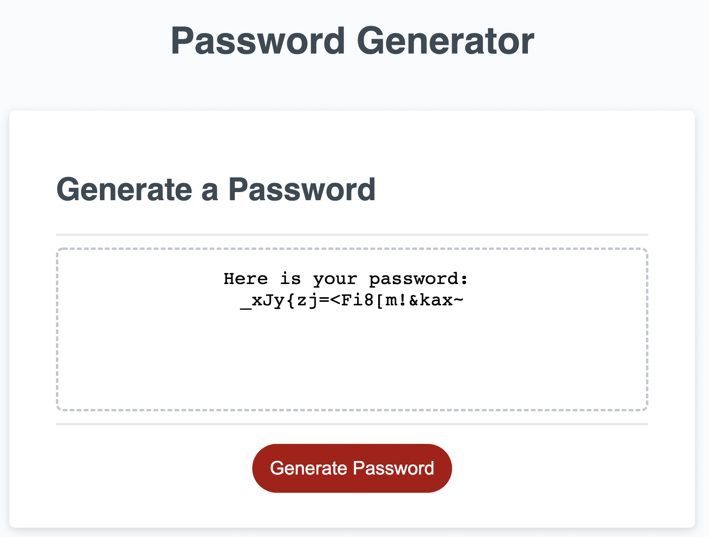

# 03-password-generator

```
A Problem that Needs a Solution
```
Maintaining strong passwords is one of the most important practices for individuals to undertake if they are to be part of our internet connected society.  Creating truly secure passwords can be a challenge in and of itself.  The goal of this project is to create an application that enables the user to generate random passwords based on criteria that has been selected, which includes the following:
- Password length
- Lowercase letters
- Uppercase letters
- Numbers
- Special Characters

  

```
Challenges
```
As with any coding challenge, string manipulation is a subject that can be solved in a variety of ways.  Even though the end result is to return a string value, arrays could be used as part of the process.  Regardless of how the characters are stored, the process of randomizing the characters can depend on the programming language being used.  

Although there are numerous ways to solve this problem, the fact remains that the language will influence how this challenge will be approached. The standard library of each language comes with its own methods and functions to help assist in reaching the end goal. That being the case, coming up with a solution might require differing degrees of time and effort since the programmer may need to define more custom functions depending on the language.

```
The Solution and what I Learned
```
JavaScript is the programming language that was used to solve this problem.  As mentioned above in the challenges section, the JavaScript standard library influenced my approach.  In my code, I made use of functions and methods that are already available.  However, I also had to create my own functions to compliment what was already there.  

As part of the process, I found that calling my custom functions within other functions proved to be helpful in establishing the control flow of the application. While learning how to effectively use conditional statements, along with comparison and logical operators, I combined all of them with the functions I created. This gave me insight into how important it is to understand how to break down a problem so that a solution can be reached regardless of the programming language being used.  

Repetitive tasks also need to have an effective solution to reduce the amount of code in the program.
For this, I made use of for loops to execute blocks of code that could have otherwise added a significant number of lines. It's primary use was to randomly choose an index inside a string, and then store the character in that index into a variable which would ultimately become the password.  

This brings us to the next problem that needed to be solved: how to randomize the process of repetitively choosing an index.  Since the location of an index is determined by an integer value, I needed to find a way to randomly produce integers. For this I used two methods built into JavaScript:  `Math.random()` and `Math.floor()`.  After combining these methods into a function of my own creation, I then used that function inside the for loop to repeat the process of randomly choosing characters based on their index.

```
Conclusion
```
The primary importance of this exercise wasn't to teach how to code with JavaScript.  
**The primary importance of this exercise was to teach how to think like a programmer.**  
Programming languages all share some common characteristics, and if you don't have a solid understanding of how they work, then it doesn't matter what language is used.  Breaking down a problem into a series of small and understandable steps gives insight into the process of how a person thinks. The language that individuals choose is simply a tool that allows them to express that thought process.  It helps them to communicate with others as to how they reached their solution, which in turn can open doors to collaboration towards a common goal and a better solution that benefits everyone.
